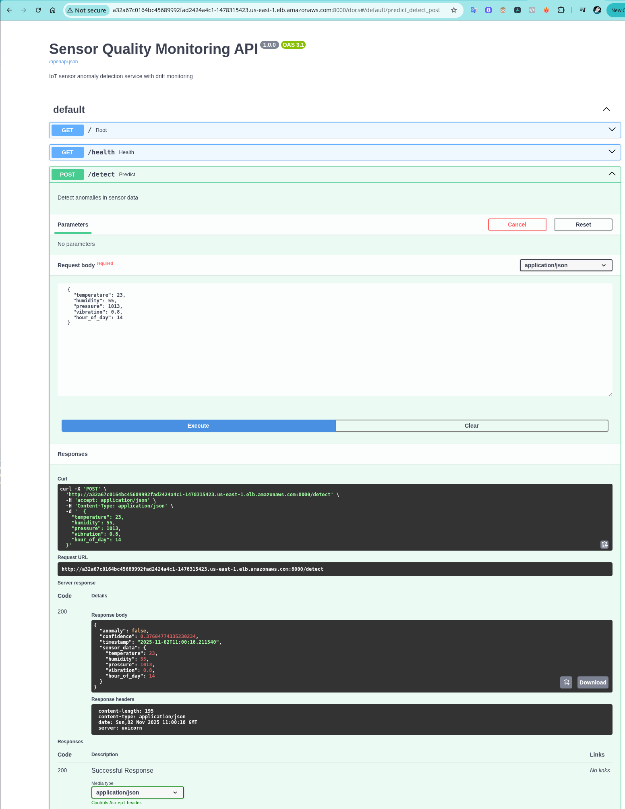
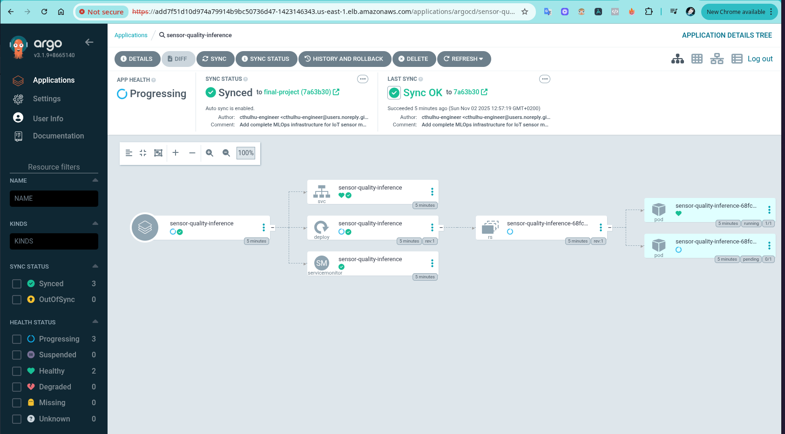
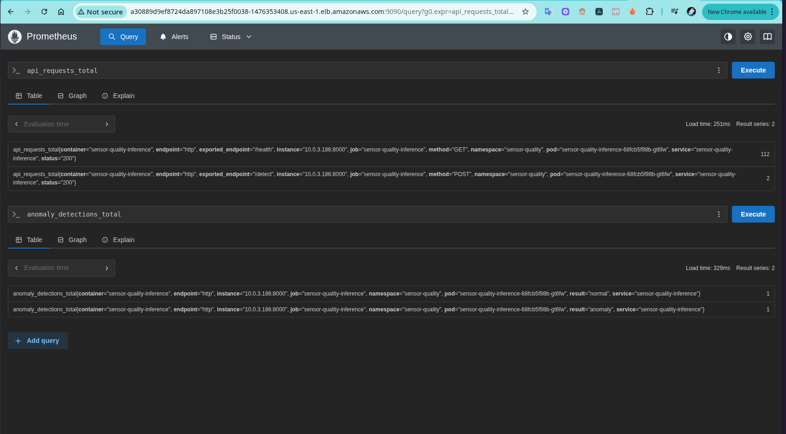
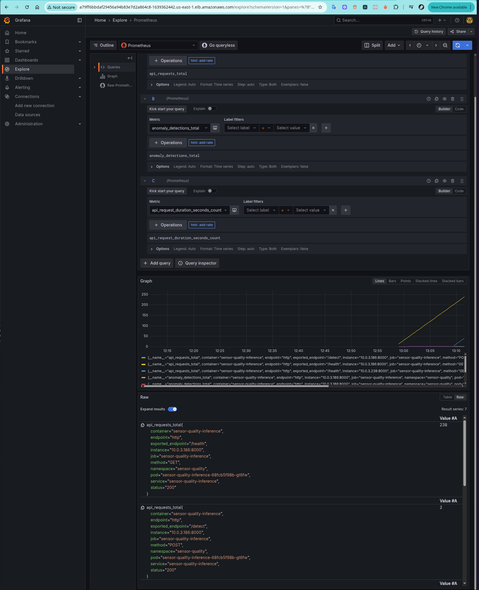
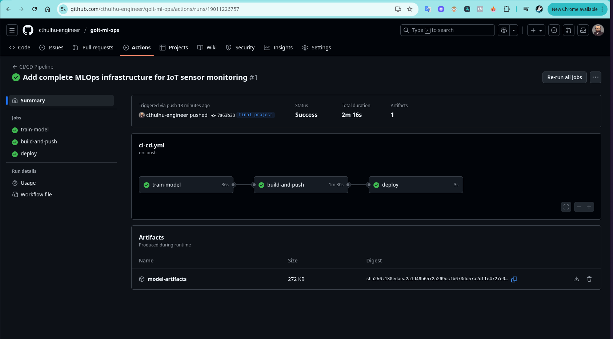
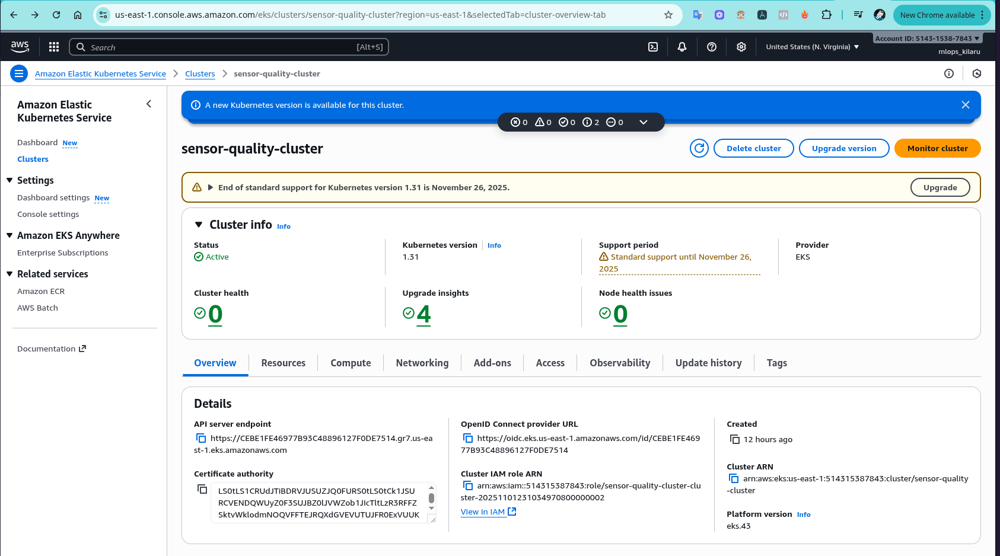
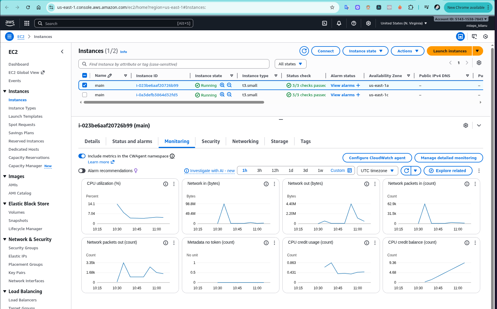
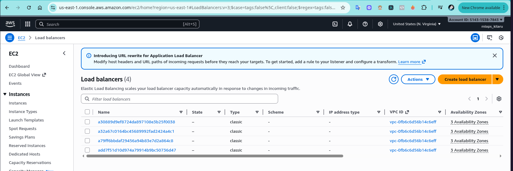

# IoT Sensor Quality Monitoring - MLOps Final Project

Production-ready MLOps infrastructure for IoT sensor anomaly detection with **data drift detection**, **auto-retraining**, **GitOps deployment**, and comprehensive **monitoring**.

## 🏗️ Architecture Overview

This project implements a complete MLOps pipeline with:

- **FastAPI**: REST API inference service with drift detection
- **Isolation Forest**: Unsupervised ML model for anomaly detection
- **Drift Detection**: Statistical KS-test based drift detector
- **Auto-Retraining**: Automatic model retraining on drift or high anomaly rate
- **Kubernetes (EKS)**: Container orchestration on AWS
- **ArgoCD**: GitOps continuous deployment
- **Prometheus + Grafana**: Metrics collection and visualization
- **GitHub Actions**: CI/CD pipeline with retrain workflow
- **Terraform**: Infrastructure as Code for AWS EKS

## 📋 System Components

| Component | Description |
|-----------|-------------|
| **FastAPI Service** | Wraps trained `.pkl` model as inference API with `/detect` endpoint |
| **Helm Charts** | Kubernetes deployment configuration with monitoring |
| **ArgoCD** | GitOps deployment with auto-sync from Git repository |
| **Prometheus + Grafana** | Pod metrics, latencies, request rates, drift alerts |
| **Drift Detector** | Statistical drift detection (Kolmogorov-Smirnov test) |
| **GitHub Actions** | CI/CD pipeline + automatic retrain workflow |

## 📸 Screenshots

### Application & Monitoring

| Component | Screenshot |
|-----------|-----------|
| **Swagger UI - Anomaly Detection** |  |
| **ArgoCD - Deployed Application** |  |
| **Prometheus - Metrics** |  |
| **Grafana - Dashboard** |  |
| **GitHub Actions - CI/CD** |  |

### AWS Infrastructure

| AWS Service | Screenshot |
|-------------|-----------|
| **EKS Cluster** |  |
| **EC2 Worker Nodes** |  |
| **Load Balancers** |  |

## 🚀 Quick Start

### 1. Local Development

```bash
# Install dependencies
pip install -r requirements.txt

# Train model
python model/train_iot_sensors.py

# Run API locally
uvicorn app.main:app --reload --port 8000

# Test API
curl -X POST "http://localhost:8000/detect" \
  -H "Content-Type: application/json" \
  -d '{"temperature": 23, "humidity": 55, "pressure": 1013, "vibration": 0.8, "hour_of_day": 14}'
```

### 2. AWS EKS Deployment

Complete deployment guide in [AWS_SETUP.md](AWS_SETUP.md).

```bash
# 1. Configure AWS CLI
aws configure

# 2. Deploy infrastructure with Terraform
cd terraform
terraform init
terraform apply -auto-approve

# 3. Configure kubectl
aws eks update-kubeconfig --region us-east-1 --name sensor-quality-cluster

# 4. Install monitoring stack
chmod +x terraform/install-stack.sh
./terraform/install-stack.sh

# 5. Deploy application via ArgoCD
kubectl apply -f argocd/sensor-quality-inference.yaml
```

## 🧪 Testing the System

### Test Anomaly Detection

```bash
# Normal data (should return anomaly: false)
curl -X POST "http://[APP_URL]:8000/detect" \
  -H "Content-Type: application/json" \
  -d '{
    "temperature": 22,
    "humidity": 55,
    "pressure": 1013,
    "vibration": 0.5,
    "hour_of_day": 14
  }'

# Anomalous data (should return anomaly: true)
curl -X POST "http://[APP_URL]:8000/detect" \
  -H "Content-Type: application/json" \
  -d '{
    "temperature": 95,
    "humidity": 5,
    "pressure": 950,
    "vibration": 8.5,
    "hour_of_day": 14
  }'
```

### Check API Health

```bash
curl http://[APP_URL]:8000/health
curl http://[APP_URL]:8000/stats
```

## 📊 Monitoring & Logging

### View Application Logs

```bash
# Stream logs from all pods
kubectl logs -n sensor-quality -l app.kubernetes.io/name=sensor-quality-inference -f

# Check last 100 lines
kubectl logs -n sensor-quality -l app.kubernetes.io/name=sensor-quality-inference --tail=100
```

**Expected log format:**
```
INFO: 📥 Incoming data: temp=23.0, humidity=55.0, pressure=1013.0, vibration=0.8, hour=14
INFO: 📤 Prediction: 🟢 NORMAL, confidence: 0.1234, anomaly_rate: 5/100
WARNING: ⚠️ DRIFT DETECTED! p-values: [0.001, 0.032, 0.048, 0.012, 0.089]
INFO: ✅ Retrain workflow triggered: Data drift detected
```

### Access Grafana Dashboard

```bash
# Get Grafana URL
kubectl get svc kube-prometheus-stack-grafana -n monitoring

# Default credentials: admin / admin
```

**Dashboard includes:**
- API Requests per Minute
- Request Latency (p95, p99)
- Anomaly Detection Rate
- Drift Events Count
- Request Duration Heatmap

### Query Prometheus Metrics

```bash
# Get Prometheus URL
kubectl get svc kube-prometheus-stack-prometheus -n monitoring

# Example queries:
# - rate(api_requests_total[1m])
# - histogram_quantile(0.95, rate(api_request_duration_seconds_bucket[5m]))
# - anomaly_detections_total
# - drift_events_total
```

## 🔍 Drift Detection

The system monitors **data drift** using statistical tests:

**How it works:**
1. **Reference Distribution**: First 1000 predictions are stored as baseline
2. **Current Window**: Latest 100 predictions are compared against baseline
3. **KS Test**: Kolmogorov-Smirnov test for each feature (threshold: p-value < 0.05)
4. **Drift Trigger**: If drift detected → automatic retrain workflow starts

**Anomaly Rate Trigger:**
- If >30% of predictions are anomalies over 100 samples → retrain

### Verify Drift Detection

```bash
# Send 100+ anomalous requests to trigger drift
for i in {1..110}; do
  curl -X POST "http://[APP_URL]:8000/detect" \
    -H "Content-Type: application/json" \
    -d "{\"temperature\": $((RANDOM % 30 + 70)), \"humidity\": $((RANDOM % 20)), \"pressure\": $((RANDOM % 50 + 950)), \"vibration\": $((RANDOM % 5 + 5)), \"hour_of_day\": $((RANDOM % 24))}"
  sleep 0.5
done

# Check logs for drift detection
kubectl logs -n sensor-quality -l app.kubernetes.io/name=sensor-quality-inference | grep "DRIFT DETECTED"
```

## 🔄 Auto-Retraining Pipeline

### How Retraining Works

1. **Drift Detected** → FastAPI triggers GitHub Actions workflow
2. **Retrain Job** runs:
   - Fetches latest data
   - Trains new Isolation Forest model
   - Builds new Docker image
   - Pushes to GitHub Container Registry
3. **ArgoCD** detects new image → auto-syncs deployment
4. **Zero downtime** deployment with rolling update

### Manual Trigger Retrain

```bash
# Via GitHub CLI
gh workflow run retrain.yml --ref final-project -f reason="Manual retrain test"

# Via API
curl -X POST \
  -H "Authorization: token $GITHUB_TOKEN" \
  -H "Accept: application/vnd.github.v3+json" \
  https://api.github.com/repos/cthulhu-engineer/goit-ml-ops/actions/workflows/retrain.yml/dispatches \
  -d '{"ref":"final-project","inputs":{"reason":"Manual retrain"}}'
```

### Verify Retrain Pipeline

```bash
# Check GitHub Actions runs
gh run list --workflow=retrain.yml

# Watch retrain progress
gh run watch

# Check ArgoCD sync status
kubectl get application sensor-quality-inference -n argocd -o yaml
```

## 🔧 Updating the Model

### Option 1: Via Drift Detection (Automatic)

Just send anomalous data → system auto-retrains when threshold reached.

### Option 2: Via Manual Retrain

```bash
# Trigger retrain workflow
gh workflow run retrain.yml --ref final-project -f reason="Performance improvement"

# Wait for completion (~5 minutes)
gh run watch

# Verify new image deployed
kubectl get pods -n sensor-quality -w
```

### Option 3: Local Development

```bash
# Train new model locally
python model/train_iot_sensors.py

# Build and push image
docker build -t ghcr.io/cthulhu-engineer/goit-ml-ops/sensor-quality-inference:latest .
docker push ghcr.io/cthulhu-engineer/goit-ml-ops/sensor-quality-inference:latest

# ArgoCD will auto-sync within 3 minutes
```

## 📁 Project Structure

```
.
├── app/
│   └── main.py                 # FastAPI service with drift detection
├── model/
│   └── train_iot_sensors.py    # Model training script
├── helm/
│   ├── Chart.yaml              # Helm chart metadata
│   ├── values.yaml             # Configuration values
│   └── templates/              # K8s manifests
│       ├── deployment.yaml
│       ├── service.yaml
│       └── servicemonitor.yaml
├── argocd/
│   └── sensor-quality-inference.yaml  # ArgoCD application
├── .github/workflows/
│   ├── ci-cd.yml               # Main CI/CD pipeline
│   └── retrain.yml             # Retrain workflow
├── grafana/
│   └── dashboards.json         # Grafana dashboard
├── prometheus/
│   └── additionalScrapeConfigs.yaml  # Prometheus config
├── terraform/
│   ├── main.tf                 # EKS cluster configuration
│   ├── variables.tf
│   └── outputs.tf
├── Dockerfile                  # Container image definition
├── requirements.txt            # Python dependencies
└── README.md                   # This file
```

## 🎯 Verification Checklist

- [x] **API Working**: `kubectl port-forward` shows working API
- [x] **Predictions**: Responses contain prediction + confidence score
- [x] **Logging**: Drift messages visible in `kubectl logs`
- [x] **Grafana**: Dashboard shows traffic, latency, anomalies
- [x] **GitHub Actions**: Retrain workflow executes successfully
- [x] **ArgoCD**: Pulls updated Helm chart and syncs deployment
- [x] **Drift Detection**: Statistical tests trigger on anomalous data
- [x] **Auto-Retrain**: Pipeline starts on drift/high anomaly rate

## 🛠️ Key Metrics

Prometheus metrics exposed on `/metrics`:

- `api_requests_total` - Total API requests by endpoint and status
- `api_request_duration_seconds` - Request latency histogram
- `anomaly_detections_total{result="anomaly|normal"}` - Anomaly counts
- `drift_events_total` - Data drift detection events
- `active_sensors` - Current number of active sensors

## 🔒 Security Notes

- GitHub Actions uses `GITHUB_TOKEN` for container registry access
- ArgoCD requires GitHub PAT for private repositories
- AWS credentials configured via `aws configure`
- All secrets managed via Kubernetes Secrets / GitHub Secrets

## 🧹 Cleanup

```bash
# Delete ArgoCD application
kubectl delete application sensor-quality-inference -n argocd

# Destroy AWS infrastructure
cd terraform
terraform destroy -auto-approve
```
