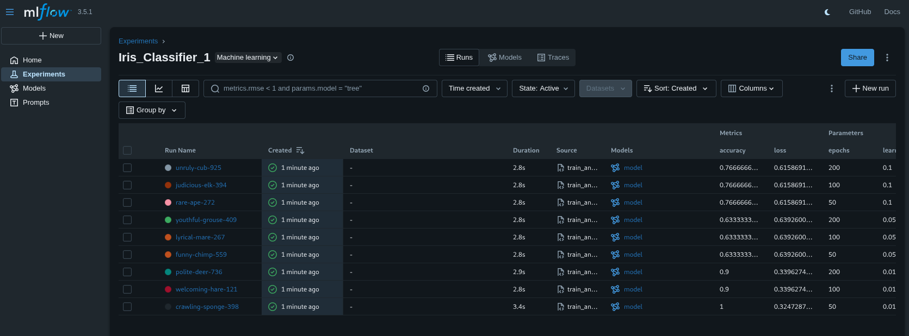
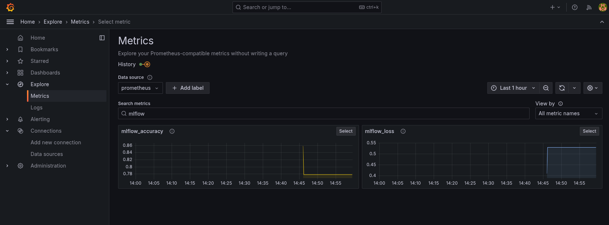

# MLOps Lesson 8-9: ML Experiment Tracking з MLflow та моніторинг через Grafana

## 🎯 Мета завдання
- Провести трекінг ML-експериментів через MLflow
- Логувати параметри, метрики, артефакти
- Автоматично вибрати кращу модель
- Вивести ключові метрики експерименту в Grafana через PushGateway
- Розгорнути всі сервіси декларативно через ArgoCD

## 🚀 1. Розгортання інфраструктури

### Крок 1.1: Запуск Minikube
```bash
# Запуск Minikube з достатніми ресурсами
minikube start --memory=4096 --cpus=2

# Перевірка статусу
minikube status
```

### Крок 1.2: Встановлення ArgoCD
```bash
# Створення namespace для ArgoCD
kubectl create namespace argocd

# Встановлення ArgoCD
kubectl apply -n argocd -f https://raw.githubusercontent.com/argoproj/argo-cd/stable/manifests/install.yaml

# Очікування готовності ArgoCD
kubectl wait --for=condition=available --timeout=300s deployment/argocd-server -n argocd

# Перевірка статусу
kubectl get pods -n argocd
```

### Крок 1.3: Доступ до ArgoCD UI (опціонально)
```bash
# Отримання пароля для admin
kubectl -n argocd get secret argocd-initial-admin-secret -o jsonpath="{.data.password}" | base64 -d

# Port-forward для доступу до UI
kubectl port-forward svc/argocd-server -n argocd 8080:443
# Доступ: https://localhost:8080 (admin / <password>)
```

## 🎯 2. Розгортання MLOps сервісів через ArgoCD

### Крок 2.1: Створення namespaces
```bash
# Namespace для MLflow інфраструктури
kubectl create namespace mlflow

# Namespace для моніторингу
kubectl create namespace monitoring
```

### Крок 2.2: Застосування ArgoCD Applications
```bash
# Застосування всіх applications
kubectl apply -f argocd/applications/

# Перевірка створених applications
kubectl get applications -n argocd
```

**Очікуваний вивід:**
```
NAME              SYNC STATUS   HEALTH STATUS
minio             Synced        Healthy
mlflow-postgres   Synced        Healthy
mlflow            Synced        Healthy
pushgateway       Synced        Healthy
prometheus        Synced        Healthy
grafana           Synced        Healthy
```

### Крок 2.3: Перевірка розгорнутих ресурсів

```bash
# Перевірка pods у namespace mlflow
kubectl get pods -n mlflow

# Перевірка pods у namespace monitoring
kubectl get pods -n monitoring

# Перевірка сервісів
kubectl get svc -n mlflow
kubectl get svc -n monitoring
```

**Розгорнуті компоненти:**
- ✅ **MinIO** - S3-сумісне сховище для артефактів MLflow
- ✅ **PostgreSQL** - База даних для MLflow backend
- ✅ **MLflow Tracking Server** - Центральний сервер для трекінгу експериментів
- ✅ **PushGateway** - Prometheus PushGateway для збору метрик
- ✅ **Prometheus** - Система моніторингу та збору метрик
- ✅ **Grafana** - Платформа візуалізації метрик

## 🌐 3. Налаштування доступу до сервісів

### Крок 3.1: Port-forward для всіх сервісів

Для доступу до сервісів з локальної машини налаштуємо port-forward:

```bash
# PushGateway
kubectl port-forward svc/pushgateway-prometheus-pushgateway -n mlflow 9091:9091 &

# Prometheus
kubectl port-forward svc/prometheus-server -n monitoring 9090:80 &

# Grafana
kubectl port-forward svc/grafana -n monitoring 3001:80 &

# MinIO (опціонально, для перевірки)
kubectl port-forward svc/minio -n mlflow 9000:9000 9001:9001 &
```

### Крок 3.2: Запуск локального MLflow UI

Для зручної роботи з експериментами запустимо MLflow UI локально:

```bash
# Створення Python віртуального середовища
python3 -m venv mlops-env
source mlops-env/bin/activate

# Встановлення залежностей
pip install mlflow scikit-learn

# Запуск MLflow UI
mlflow ui --backend-store-uri file:./mlruns --port 5000 &
```

> **Примітка:** MLflow UI працює локально з файловим backend для спрощення демонстрації. У production середовищі він підключається до PostgreSQL в кластері.

### 🔗 Доступні URL сервісів:

| Сервіс | URL | Логін/Пароль | Deployment |
|--------|-----|--------------|------------|
| **MLflow UI** | http://localhost:5000 | - | Локально (для UI) |
| **Grafana** | http://localhost:3001 | admin/admin123 | Kubernetes + port-forward |
| **Prometheus** | http://localhost:9090 | - | Kubernetes + port-forward |
| **PushGateway** | http://localhost:9091 | - | Kubernetes + port-forward |

## 🧪 4. Запуск ML експериментів

### Крок 4.1: Опис скрипту train_and_push.py

Скрипт `experiments/train_and_push.py` виконує наступні операції:

1. **Завантаження датасету Iris** з sklearn
2. **Grid Search** по параметрах:
   - `learning_rate`: [0.01, 0.05, 0.1]
   - `epochs`: [50, 100, 200]
   - **Всього: 9 експериментів**
3. **Для кожного експерименту:**
   - Тренування SGD Classifier
   - Логування параметрів (learning_rate, epochs) в MLflow
   - Логування метрик (accuracy, loss) в MLflow
   - Збереження моделі як MLflow артефакт
   - **Відправка метрик в PushGateway** (в Kubernetes через port-forward)
4. **Автоматичний вибір:**
   - Знаходження моделі з найкращою accuracy
   - Копіювання найкращої моделі в `best_model/`

### Крок 4.2: Запуск експериментів

```bash
# Активація віртуального середовища
source mlops-env/bin/activate

# Запуск експериментів (метрики відправляються в PushGateway в кластері)
python experiments/train_and_push.py
```

### Крок 4.3: Очікуваний результат

```
🚀 Запуск ML експериментів з логуванням в MLflow та PushGateway...
📊 Експеримент: Iris_Classifier_1
🔗 PushGateway: http://localhost:9091

🧪 Запуск 3 x 3 = 9 експериментів...

📈 Експеримент 1/9: lr=0.01, epochs=50
   🎯 Accuracy: 1.0000
   📉 Loss: 0.3247
   📤 Метрики відправлені в PushGateway
   🏆 Нова найкраща модель! Accuracy: 1.0000

📈 Експеримент 2/9: lr=0.01, epochs=100
   🎯 Accuracy: 0.9000
   📉 Loss: 0.3396
   📤 Метрики відправлені в PushGateway

...

🎉 Експерименти завершені!
🏆 Найкраща модель:
   Run ID: fb001148882048b5b7c391af373ddb59
   Accuracy: 1.0000

📦 Копіювання найкращої моделі в best_model/...
✅ Найкраща модель збережена в best_model/
```

## 📊 5. Налаштування та перегляд метрик у Grafana

### Крок 5.1: Вхід в Grafana

1. Відкрийте **http://localhost:3001** (Grafana в Kubernetes через port-forward)
2. Введіть логін: **admin**
3. Введіть пароль: **admin123**

### Крок 5.2: Додавання Prometheus як Data Source

1. В лівому меню натисніть **"Connections"** → **"Data sources"**
2. Натисніть кнопку **"Add data source"**
3. Виберіть **"Prometheus"**
4. В полі **"Prometheus server URL"** введіть: `http://localhost:9090`
   > **Примітка:** Використовуємо localhost, оскільки працюємо через port-forward
5. Прокрутіть вниз і натисніть **"Save & Test"**
6. Повинно з'явитися зелене повідомлення **"Data source is working"**

### Крок 5.3: Перегляд метрик через Explore

1. В лівому меню натисніть **"Explore"** (іконка компаса)
2. Переконайтеся що вибрано **"Prometheus"** як data source
3. В полі **"Metric"** почніть вводити назви метрик

**📊 Доступні MLflow метрики:**

```promql
# Точність всіх моделей
mlflow_accuracy

# Втрати всіх моделей
mlflow_loss

# Найкраща точність
max(mlflow_accuracy)

# Середня точність по learning_rate
avg(mlflow_accuracy) by (learning_rate)

# Точність для конкретного learning_rate
mlflow_accuracy{learning_rate="0.01"}

# Втрати для конкретної кількості epochs
mlflow_loss{epochs="50"}

# Порівняння моделей з різними параметрами
mlflow_accuracy{learning_rate="0.01"} or mlflow_accuracy{learning_rate="0.05"} or mlflow_accuracy{learning_rate="0.1"}
```

### Крок 5.4: Структура метрик

Кожна метрика містить наступні лейбли:
- **run_id** - унікальний ідентифікатор експерименту MLflow
- **learning_rate** - значення learning rate ("0.01", "0.05", "0.1")
- **epochs** - кількість епох ("50", "100", "200")
- **job** - назва job в Prometheus ("mlflow_experiment")

### Крок 5.5: Альтернативний доступ

- **Prometheus UI**: http://localhost:9090 (для перевірки таргетів та метрик)
- **PushGateway**: http://localhost:9091/metrics (для перевірки відправлених метрик)

## 📸 6. Скріншоти результатів

### MLflow UI - Експерименти та моделі


**На скріншоті видно:**
- Всі 9 експериментів з експерименту "Iris_Classifier_1"
- Параметри кожного експерименту (learning_rate, epochs)
- Метрики для кожного run (accuracy, loss)
- Збережені моделі як артефакти
- Найкращий результат: accuracy = 1.0000

### Grafana - Візуалізація метрик MLflow


**На скріншоті видно:**
- Grafana підключена до Prometheus як data source
- Метрики `mlflow_accuracy` та `mlflow_loss` успішно відображаються
- Дані зібрані з PushGateway через Prometheus
- Можливість фільтрації по параметрах (learning_rate, epochs)

## 📁 7. Структура проєкту

```
mlops-lesson-9/
├── argocd/                         # ArgoCD Applications
│   └── applications/
│       ├── grafana.yaml            # Grafana deployment
│       ├── minio.yaml              # MinIO S3 storage
│       ├── mlflow.yaml             # MLflow Tracking Server
│       ├── mlflow-postgres.yaml    # PostgreSQL для MLflow
│       ├── mlflow-secrets.yaml     # Секрети для MLflow
│       ├── prometheus.yaml         # Prometheus
│       └── pushgateway.yaml        # PushGateway
├── experiments/
│   ├── train_and_push.py          # ML скрипт з інтеграцією MLflow + PushGateway
│   └── requirements.txt           # Python залежності
├── images/                        # Скріншоти
│   ├── mlflow.png                 # MLflow UI з експериментами
│   └── grafana.png                # Grafana з метриками
├── best_model/                    # Найкраща модель (створюється автоматично)
│   ├── best_model.pkl             # Збережена модель
│   └── metadata.txt               # Метадані моделі
├── mlruns/                        # MLflow локальні експерименти
├── README.md                      # Ця документація
└── task.md                        # Оригінальне завдання
```

## 🎯 8. Технічна реалізація

### 8.1. ArgoCD Applications

Всі компоненти розгорнуті декларативно через ArgoCD:

**argocd/applications/minio.yaml:**
- Deployment MinIO з persistent volume
- Service для доступу до S3 API
- Автоматичне створення bucket `mlflow-artifacts`

**argocd/applications/mlflow-postgres.yaml:**
- StatefulSet PostgreSQL
- Persistent volume для даних
- Service для підключення MLflow

**argocd/applications/mlflow.yaml:**
- Deployment MLflow Tracking Server
- Environment variables для підключення до PostgreSQL та MinIO
- Service типу ClusterIP

**argocd/applications/pushgateway.yaml:**
- Deployment Prometheus PushGateway
- Service для прийому метрик
- Налаштування для збереження метрик

**argocd/applications/prometheus.yaml:**
- Deployment Prometheus
- ConfigMap з конфігурацією scrape для PushGateway
- Service для доступу до UI та API

**argocd/applications/grafana.yaml:**
- Deployment Grafana
- ConfigMap з налаштуваннями
- Service для доступу до UI

### 8.2. Потік даних

```
ML Script (train_and_push.py)
    ↓
    ├─→ MLflow Tracking (локально, file backend)
    │   ├─→ Параметри (learning_rate, epochs)
    │   ├─→ Метрики (accuracy, loss)
    │   └─→ Артефакти (model.pkl)
    │
    └─→ PushGateway (Kubernetes, port-forward :9091)
        ↓
        Prometheus (Kubernetes, scrape кожні 15s)
        ↓
        Grafana (Kubernetes, візуалізація)
```